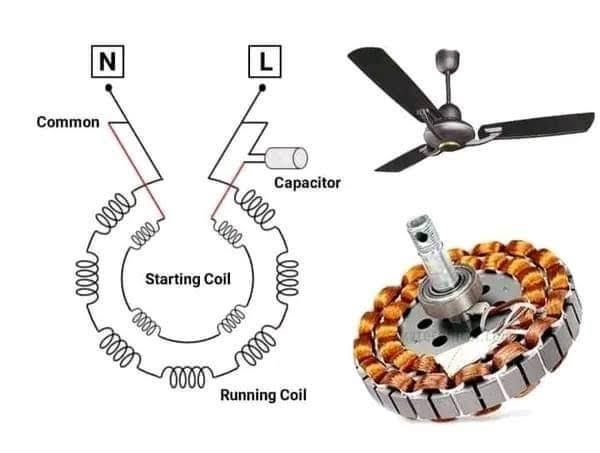

## Ceiling-Fan-Wiring

<!--[profile](./w.jpg)-->

## Runing and starding বাহির করা।

(১) লাল+কাল=৩৮৮ অহুম

(২) লাল+হলোদ=২৫৪ অহুম

(৩) কাল+হলোদ= ১৮৩ অহমু

এখানে যে ২ তারে অহুম বেশি দেখাইছে ঐ ২ টি হলো Runing and starding কয়েলের তার।

