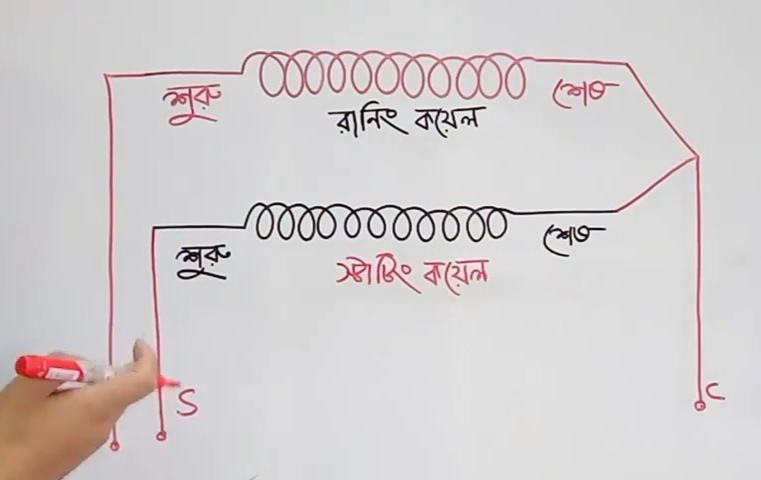

## Ceiling-Fan-Wiring

<!--[profile](./r.jpg)-->

## end

<!--[profile](./w.jpg)-->

## Runing and starding বাহির করা।

(১) লাল+কাল=৩৮৮ অহুম

(২) লাল+হলোদ=২৫৪ অহুম

(৩) কাল+হলোদ= ১৮৩ অহমু

এখানে যে ২ তারে অহুম বেশি দেখাইছে ঐ ২ টি হলো Runing and starding কয়েলের তার।

যেমন:- লাল+কাল=৩৮৮ অহুম Runing and starding 

## কমন ঠিক রেখে Runing and starding ক্যাপাসিটর লাগানুর জন্য!

যেমন:- হলোদ কমন

(১) হলোদ+লাল=২৫৪

(২) হলোদ+কাল=১৫০

এখানে লাল হলো Runing প্রান্ত এবং কাল হলো staring প্রান্ত

লাল এবং কাল সিরিজ কানেকশনে ক্যাপাসিটর থাকবে।

লাল তার হয়তে Runing থেকে একটি তার জুরা দিতে হবে।

